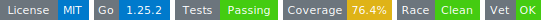

# tinywasm/css


Typed CSS DSL and design tokens for the tinywasm framework.

This module replaces string-based `.css` files with a Go-typed DSL. It exposes **both** `RootCSS()` and `RenderCSS()` with strictly separate responsibilities:

- `RootCSS()` → **vocabulary**: design token declarations — brand, source tokens, scales.
- `RenderCSS()` → **logic**: minimal reset + active-token bindings + `@media (prefers-color-scheme)`.

The DSL ensures that every selector, declaration, and token reference is a Go expression, providing compile-time safety and eliminating hex-fallback drift.

## Usage

```go
import . "github.com/tinywasm/css"

func MyComponent() {
    // WASM: Use Class or Token.Var()
    btnClass := Class("btn")
    color := ColorPrimary.Var()
}

// SSR: Use the DSL to generate CSS
func Styles() *Stylesheet {
    return NewStylesheet(
        Rule(".btn",
            BackgroundColor(ColorPrimary),
            Color(Hex("#fff")),
            Padding(Space2, Space4),
            BorderRadius(RadiusMd),
        ),
        Rule(Class("btn").Hover(),
            Opacity(0.8),
        ),
    )
}
```

## SSR contract: `RootCSS` vs `RenderCSS`

`assetmin` recognizes two CSS functions with strictly separate roles:

| Function | Slot | Replacement | Content |
|---|---|---|---|
| `RootCSS() *Stylesheet` | `open` | **Single-winner** — app replaces framework | `:root {}` value declarations (vocabulary) |
| `RenderCSS() *Stylesheet` | `middle` | **Additive** — every module's contribution is preserved | CSS rules that consume tokens via `var()` (logic) |

The split is the key to safe theming: vocabulary is replaceable so apps can rebrand; logic is additive so dark-mode switching cannot be deleted by accident.

### Theming una app (Rebrand)

Para aplicar un tema o rebrand a una aplicación, el proyecto raíz debe exponer su propio `RootCSS()`. Debido a que `assetmin` trata el bloque `:root` como un **slot de un solo ganador**, el `RootCSS()` de la app reemplaza por completo al de la librería.

```go
// config/css.go en la aplicación (!wasm)
import "github.com/tinywasm/css"

func RootCSS() *css.Stylesheet {
    return css.Root(
        css.Declare(css.ColorPrimary, "#FF6B35"),
        css.Declare(css.ColorSecondary, "#3f88bf"),
        css.Declare(css.ColorBackgroundLight, "#FAFAFA"),
        css.Declare(css.ColorBackgroundDark, "#121212"),
    )
}
```

El `RootCSS()` devuelve un stylesheet con las declaraciones de tokens que la app necesita sobrescribir. Esto asegura que la app gane en la cascada.

La app **no** necesita redeclarar los bindings de la capa activa (`--color-surface`, etc.) ni la lógica de `prefers-color-scheme`; esos viven en `RenderCSS()` y se mantienen siempre presentes.

| Quiero... | Uso... |
|---|---|
| Cambiar un color de marca | `css.Declare(css.ColorPrimary, "#hex")` |
| Cambiar el fondo en modo claro | `css.Declare(css.ColorBackgroundLight, "#hex")` |
| Ajustar un radio de borde global | `css.Declare(css.RadiusMd, "12px")` |
| Cambiar una escala tipográfica | `css.Declare(css.TextBase, "1.1rem")` |

---

## Design Tokens

Tokens are the single source of truth for all design decisions.

| Group | Purpose |
|---|---|
| Color — Brand | Fixed identity colors |
| Color — Theme | Adaptive light/dark colors |
| Typography — Size | Font-size scale (Major Third ratio) |
| Typography — Extras | Line-height, weight, letter-spacing |
| Spacing | Margin/padding/gap scale (4px grid) |
| Border-radius | Consistent corner rounding |
| Elevation | Box-shadow scale |
| Motion | Animation timing + easing curves |
| Z-index | Stacking contract |
| Breakpoints | Viewport widths (container queries / JS) |
| Container widths | Max-width primitives |

---

## Design Philosophy

- **Semantic names over values** — `ColorOnSurface` not `#ffffff`. Names describe *intent*; values can change.
- **Scales over magic numbers** — typography and spacing follow mathematical ratios so all values are proportional and limited.
- **Two-layer color pattern** — separates *source* values (per mode) from *active* tokens (used by components). `@media (prefers-color-scheme)` switches modes without JS.
- **Single override point** — apps only need to change source-layer or scale variables; the rest cascades automatically.

See [docs/ARCHITECTURE.md](docs/ARCHITECTURE.md) for more details on the theming system.

---

## DSL Reference

The DSL provides type-safe constructors for CSS properties:

- `BackgroundColor(Value)`, `Color(Value)`, `FontSize(Value)`, `MinWidth(Value)`, `MaxHeight(Value)`, `AlignSelf(Value)`, `Overflow(Value)`, `Visibility(Value)`, `TextAlign(Value)`, `TextTransform(Value)`, `TextDecoration(Value)`, `TextShadow(Value...)`, `UserSelect(Value)`, `TouchAction(Value)`, `ListStyleType(Value)`, `GridArea(Value)`, `GridTemplate(Value)`, `MarginLeft(Value)`, `MarginRight(Value)`, `MarginTop(Value)`, `MarginBottom(Value)`, `PaddingBottom(Value)`, `PaddingTop(Value)`, `PaddingLeft(Value)`, `PaddingRight(Value)`, `ListStyle(Value)`, `All(Value)`, `OverflowY(Value)`, `GridTemplateRows(Value)`, `GridTemplateColumns(Value)`, `BorderRight(Value...)`, `BorderLeft(Value...)`, `BorderBottom(Value...)`, `FlexWrap(Value)`, `FlexGrow(Value)`, `AlignContent(Value)`, `BackgroundSize(Value)`, `BackgroundPosition(Value)`, `BackgroundRepeat(Value)`, etc.
- `Padding(Value...)`, `Margin(Value...)`
- `Px(int)`, `Rem(float64)`, `Pct(int)`, `Vw(float64)`, `Vh(float64)`, `Calc(string)`, `Hex(string)`, `Str(string)`
- `Rule(selector, declarations...)`
- `Root(declarations...)`
- `Media(query, items...)`, `MediaDesktop(items...)`
- `Keyframes(name, At(at, declarations...)...)`

Keywords like `Auto`, `None`, `Block`, `Flex_`, `Center`, `Zero`, `Fixed`, `Absolute`, `Unset`, `Initial`, `FlexEnd`, `SpaceAround`, `Row`, `Column`, `Hidden`, `Visible`, `Uppercase`, `Capitalize`, `RightText`, `Relative`, `SpaceBetween`, `InlineFlex`, `Wrap`, `FlexStart`, `NoRepeat` are also provided.
